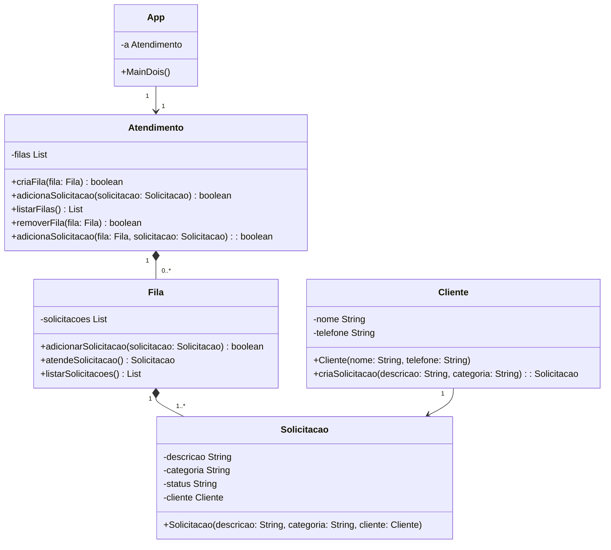

# Lista 3: Diagramas de classe

## Engenharia de Telecomunicações - Prof. Sergio Prolo

## Programação Orientada a Objetos sergio.prolo@ifsc.edu.br

#### _05/15/2025_
#### _Aluno: Arthur Oliveira dos Reis_

---

### (i). Informações Gerais

- A implementação das soluções deve seguir os princípios da Programação Orientada a Objetos,
com especial atenção à identificação correta de classes, atributos, métodos e relações (agregação,
composição, dependência).

- No repositório fornecido há um projeto Gradle padrão. Todas as soluções devem ser implementadas
nesse projeto, organizadas em pacotes distintos.

- Utilize o Git de forma adequada: commits frequentes, README.md informativo e .gitignore funcional.

- A avaliação considerará critérios de legibilidade, clareza e organização do código. Valor total: [10
pontos]

### (!) Importante!

- Cada exercício deve ser implementado em seu próprio pacote Java (package), com nomes coerentes
com a aplicação. Sugestões:

1. Login
2. Atendimento
3. Biblioteca

- Você deve entregar também os diagramas de classe (perspectiva de implementação), inseridos no
README.md do repositório.

- Pelo menos uma classe de cada pacote deve conter um método main executável que demonstre os
requisitos funcionais.

## Pacote 1 - Sistema de Login

Descrição: O Sistema de Login é composto por duas classes principais: `Gerenciador` e `Usuário`.

- O sistema é inicializado pelo `App`, que cria um único `Gerenciador` e permite o cadastro de múltiplos `Usuários` vinculados a ele.
- Cada instância de `Usuário` está associada a exatamente um `Gerenciador`.
- O `Gerenciador` pode estar associado a zero ou mais instâncias de `Usuário`.

## Pacote 2 - Fila de Atendimento

Descrição: A Fila de Atendimento é composto por três classes principais: `Atendimento`, `Fila`, `Solicitação` e `Cliente`.

- O sistema é inicializado pelo `App`, que cria uma única instância de `Atendimento`. O atendimento pode gerenciar várias instâncias de `Fila`, cada fila é composta por múltiplas instâncias de `Solicitação`, e cada solicitação está associada a um `Cliente`.
- Sem `Atendimento`, não é possível criar `Fila`, e sem fila, não é possível criar `Solicitação`. Instâncias do tipo `Cliente` podem existir no sistema, mas apenas participam da fila de atendimento quando possuem pelo menos uma solicitação registrada.
- Todas as filas registradas estão associadas a um único `Atendimento`, enquanto este pode ser associado de zero a n filas.
- A existência de uma `Fila` depende da existência de pelo menos uma `Solicitação`, pois as filas só existem se houver solicitações a serem atendidas.
- Por fim, um `Cliente` pode ter de zero a n solicitações, enquanto cada solicitação precisa estar associada a um único cliente.

